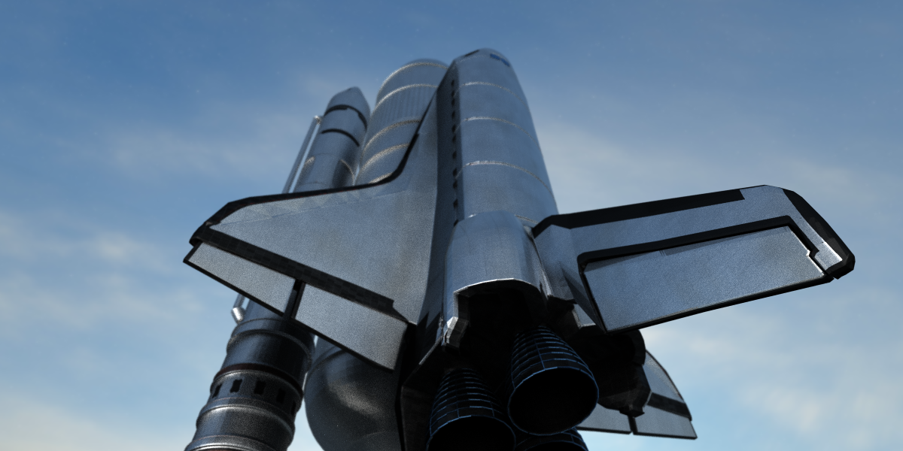
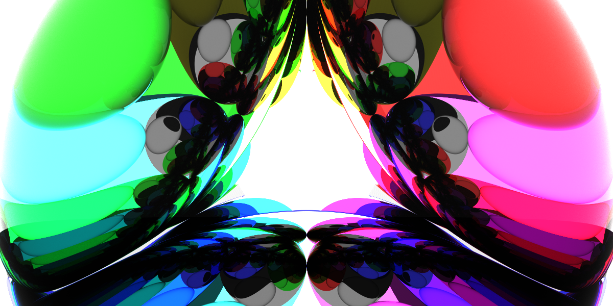
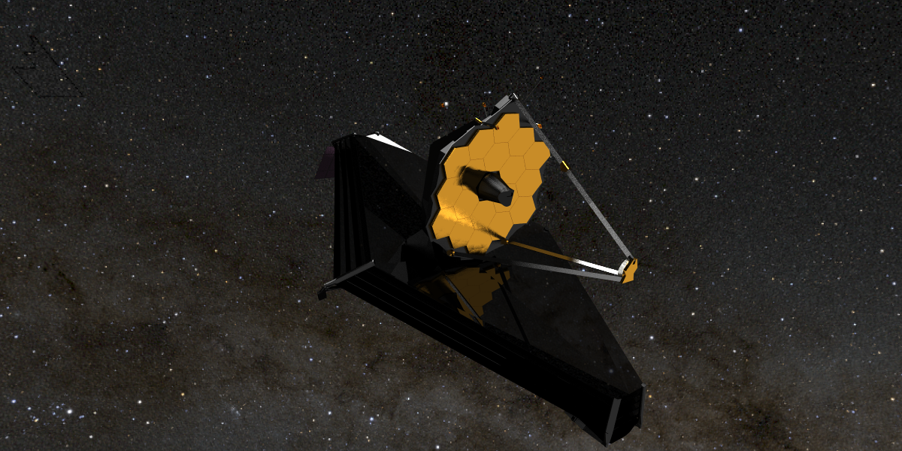
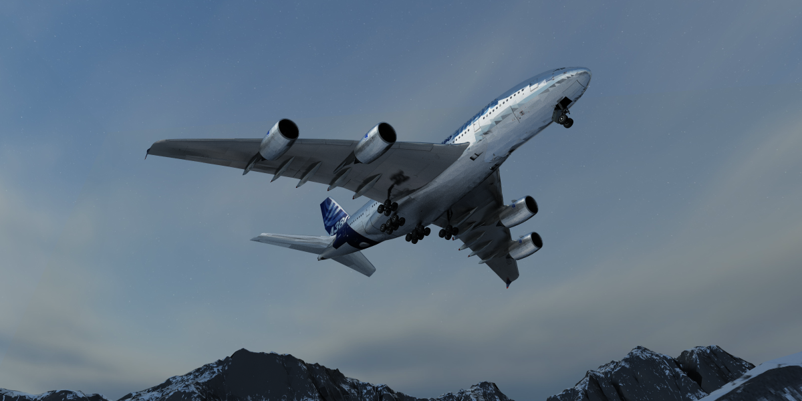
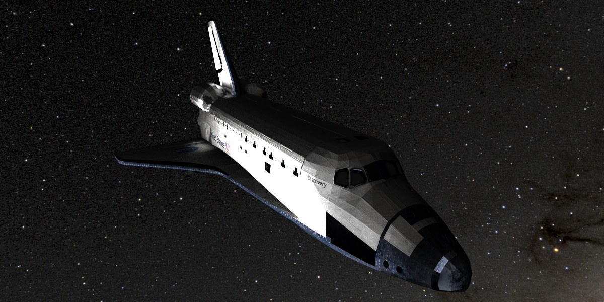
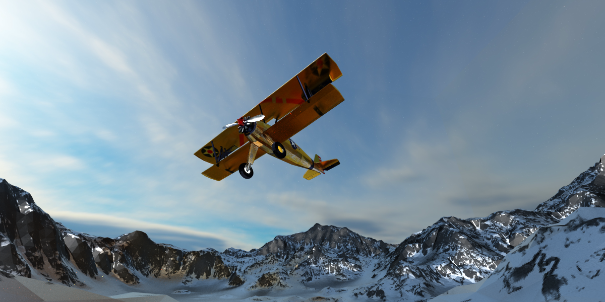
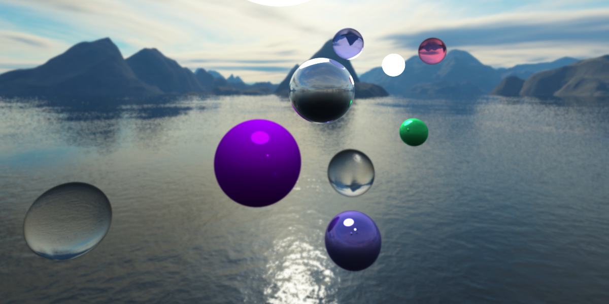
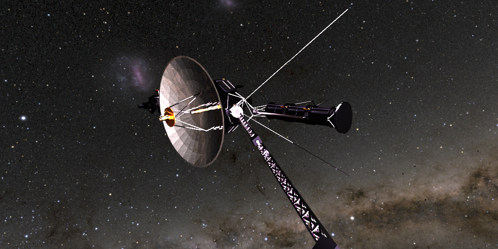
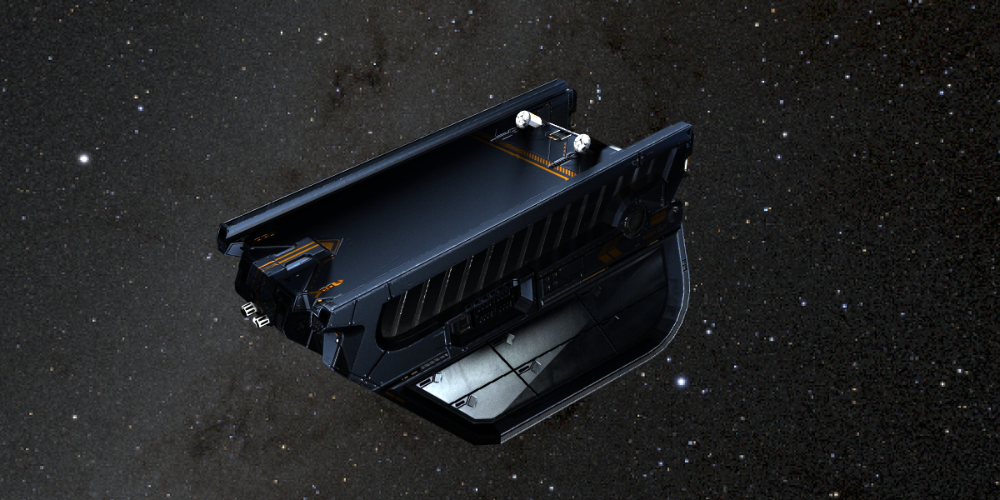
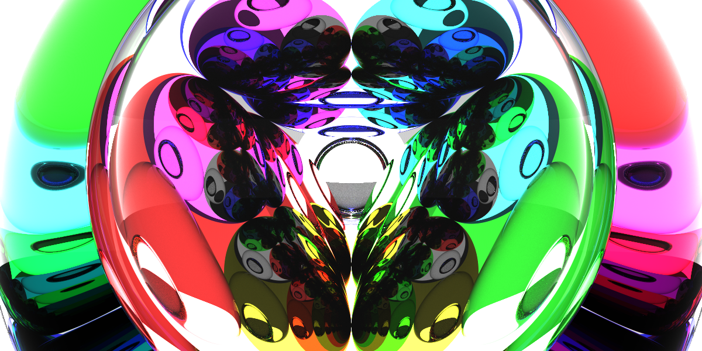

# Ray Tracing in Rust!

Ray traced rendering for realistic-looking images, all written in the Rust language!

**Comes with mesh rendering!**

<p float="middle">
    
    
    
    
</p>

*Licenses and sources for these rendered models can be found in the info/attribs folder.*

## 🚀🚀🚀 Features 🚀🚀🚀

- 🎇 Monte Carlo unidirectional path tracing
- Mesh loading via `.gltf` format! 💥💥💥
    - *some features in the `.gltf` format aren't properly implemented, however the models you see in the images worked fine for me*
- :fire: Accelerated ray tracing via k-d trees - *over 60x speedup for rendering complicated meshes!*
- Parallelized ray generation - via Rayon crate
- Dynamic scene building via yaml files
- Real-time display of rendering - stop whenever you're satisfied!
- Optional thin lens model for projection

<p float="middle">
    
    
    
    
    
    
</p>

## How to Use

1. *Optionally,* find any `.gltf` models - note location of the `.gltf` file in the folder.
2. Create/modify a yaml file to describe a scheme to render (check out schemes folder for examples).
    - Basic settings
        ```yaml
        render_info:
            width: 1200
            height: 600
            samps_per_pix: 100000 # just set it to something high and end the program when you are satisfied
            kd_tree_depth: 15 # play with this to minimize render time, more primitives means greater depth needed
            rad_info:  
                debug_single_ray: false
                dir_light_samp: false
                russ_roull_info:
                    assured_depth: 5 # minimum number of path bounces
                    max_thres: 0.5 # likelihood of path termination after assured_depth bounces
        ```
    - Camera
        ```yaml
        cam:
            o: [0, -15, -30] # position of camera
            view_eulers: [-0.6, 0.1, 0] # adjust where camera will look, rotates below settings
            d: [0, 0, 6] # render screen relative to position
            up: [0, 1, 0] # how will image be oriented? - should be unit vector !!!
            screen_width: 10.0 # in-scene width
            screen_height: 5.0 # in-scene height
            # screen_height and screen_width are not the same as width and height above
            # however the ratio should be the same for both
        ```
    - Scene members - all placed under this tag
        ```yaml
        scene_members:
            - !Model
        ```
        - Spheres
            ```yaml
            - !Sphere
                c: [4, 2, -2]
                r: 4
                coloring: !Solid [.999,0.5,0.2]
                mat:
                    divert_ray: Diff # diffuse, specular, or glass
                    emissive: [1.0, 1.0, 1.0] # optional emissive, use this to make light sources
            ```
        - Triangles
            ```yaml
                - !FreeTriangle
                    verts: [[-5, -2, -20], [5, -2, -20], [0, 5, -20]]
                    norm: [0, 0, 1]
                    rgb: [.999, .5, .5]
                    mat:
                        divert_ray: Spec
            ```
        - MESHES! 💥💥💥 - did you remember where your `.gltf` file is?
            ```yaml
                - !Model
                    path: "../../../assets/discovery_space_shuttle/scene.gltf"
                    # transforms to apply to model in the scene
                    euler_angles: [0, 1.5, 0]
                    uniform_scale: 1
                    translation: [0, 1, 0]
            ```
        - Sky box 🌠 - need 6 images for this one
            ```yaml
                - !DistantCubeMap
                    # last two numbers are scalings to texture coordinates
                    neg_x: ["../../../assets/skybox/right.jpg", 1.0, 1.0]
                    pos_x: ["../../../assets/skybox/left.jpg", 1.0, -1.0]
                    neg_y: ["../../../assets/skybox/bottom.jpg", 1.0, 1.0]
                    pos_y: ["../../../assets/skybox/top.jpg", -1.0, 1.0]
                    neg_z: ["../../../assets/skybox/back.jpg", -1.0, 1.0]
                    pos_z: ["../../../assets/skybox/front.jpg", -1.0, -1.0]
            ```
3. Run the executable with the yaml path as the first argument:
    ```bash
    ./ray_trace_rust ../../schemes/james_webb.yml 
    ```
    You'll see a UI with the currently rendered image and text output showing rendering times. Can also disable UI with:
    ```bash
    ./ray_trace_rust ../../schemes/james_webb.yml no_ui
    ```
    It is better to compile this repo with:
    ```bash
    cargo build --release
    ```
    as render times are very slow with `cargo run`.

## Why did I make this?
I wanted to combine my eagerness to learn Rust, my interest in simulations, and my love of airplanes and space into one project!

## Reference Material
While I used scraps of info from all over the internet on these algorithms, a few sources were used quite repeatedly:

- [smallpt](https://www.kevinbeason.com/smallpt/) - a tiny C++ renderer, basic template for me to get started
- [scrathapixel](https://www.scratchapixel.com/) - some of the math I used came from here
- [Review: Kd-tree Traversal Algorithms for Ray Tracing](https://onlinelibrary.wiley.com/doi/10.1111/j.1467-8659.2010.01844.x) - very helpful paper for k-d trees in ray tracing; turns out more casual sources seem to lack this info!